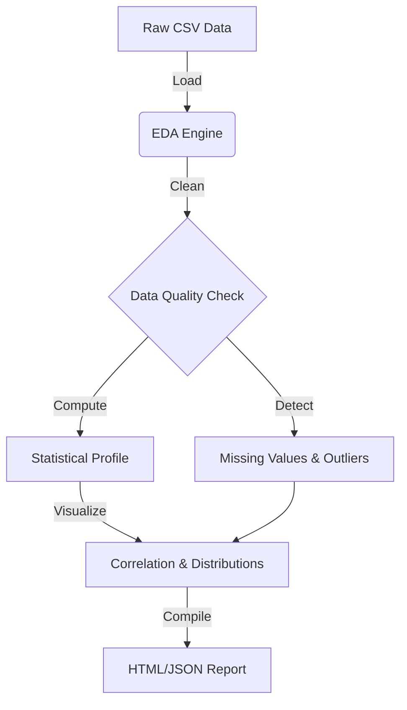

# Data Science Automated EDA Tool

[](https://www.python.org/)
[](https://pandas.pydata.org/)
[](LICENSE)

A **production-grade Automated EDA (Exploratory Data Analysis) tool** for data science workflows. This repository provides a Python engine to instantly generate comprehensive statistical reports, missing value analysis, and correlation matrices from any structured dataset.

## 📊 Analysis Pipeline

The tool processes raw data through a multi-stage pipeline to generate actionable insights.



## 🚀 Features

- **Automated Statistics**: Generates descriptive stats (mean, median, std, min/max) for numerical columns.
- **Data Quality Check**: Identifies missing values and unique counts for categorical data.
- **Correlation Analysis**: Computes Pearson correlation matrix for numerical features.
- **Outlier Detection**: Uses IQR (Interquartile Range) method to flag potential outliers.
- **Interactive Reports**: Exports findings to a self-contained HTML report with embedded visualizations.

### Sample Output Snippet

The tool generates a comprehensive analysis report including:

- **Dataset Overview**: Rows, columns, memory usage.
- **Missing Values**: `species: 1 missing (0.9%)`, `sepal_length: 1 missing (0.9%)`.
- **Outliers**: Detected 3 potential outliers in `sepal_width` using IQR method.
- **Visualizations**: Distribution histograms and correlation heatmaps.

## 📁 Project Structure

```text
data-science-automated-eda-tool/
├── src/
│   ├── eda_engine.py  # Analysis Core
│   └── main.py        # CLI Entrypoint
├── data/
│   └── sample_dataset.csv
├── requirements.txt
└── Dockerfile
```

## 🛠️ Quick Start

```bash
# Clone
git clone https://github.com/Shivay00001/data-science-automated-eda-tool.git

# Install
pip install -r requirements.txt

# Run EDA
python src/main.py --file data/sample_dataset.csv
```

## 📄 License

MIT License
